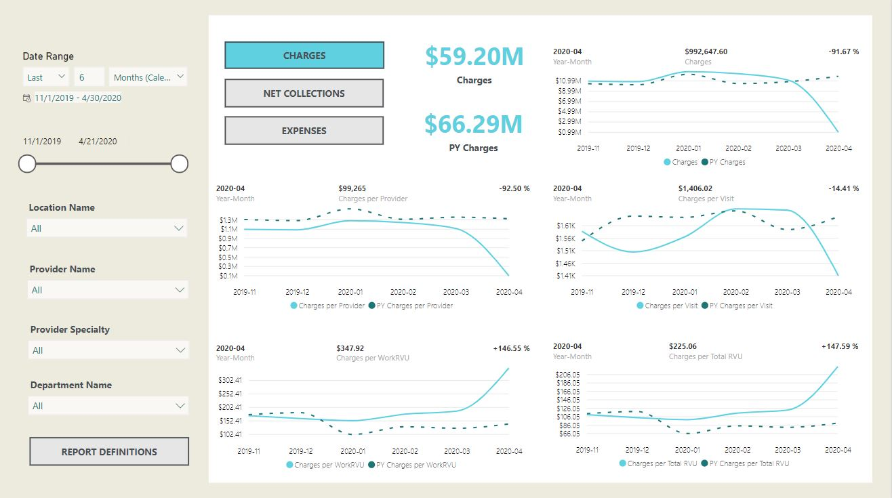
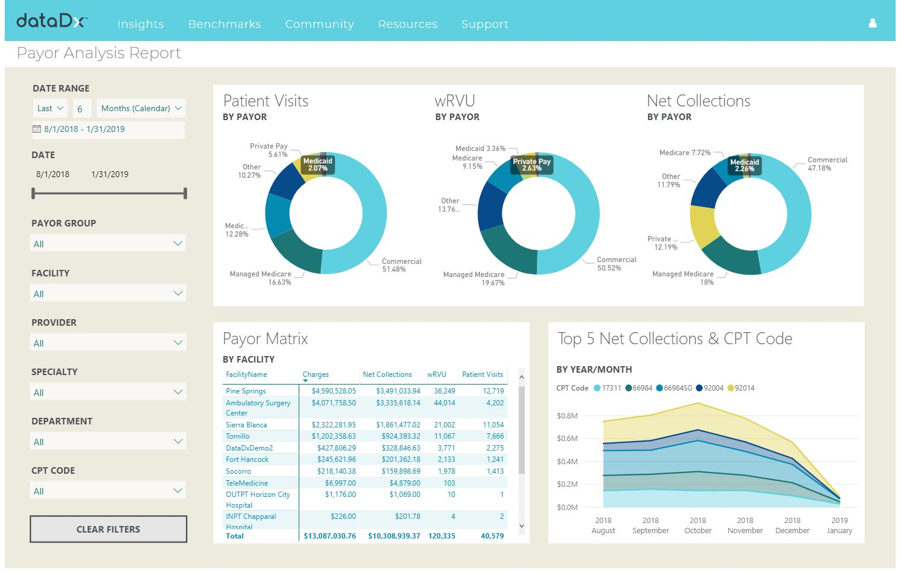
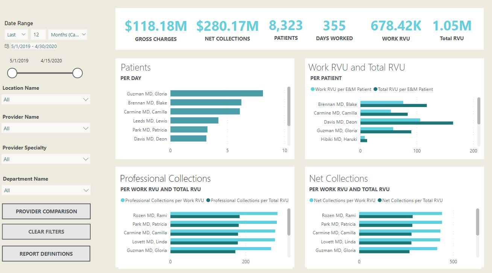

# DataDx Report Definitions 

| Report Name    | Description               |
| -------------  |-------------              |
| [Adjustments](#adjustments)           | Represents the value of services performed for which payment is not expected, such as third-party contractual adjustments, write-offs, charitable, professional courtesy or employee adjustments.        |
| [Accounts Receivable Aging](#accounts-receivable-aging)      | Shows the unpaid invoice balances along with the duration for which they've been outstanding. This report helps businesses identify invoices that are open and allows them to keep on top of slow paying clients.     |  
| [Financial Performance](#financial-performance)         | The financial performance report displays 5 key trends and ratios for measuring Charges, Net Collections, and Expenses for the selected time range and report filters. Where data is available, the Financial Performance Report allows filtering of measures by Facility (location), Provider, Specialty, or Department.         |
| [Income Statement](#income-statement)         | The Income Statement report, also known as the Profit and Loss (P&L) report, shows revenue, expense, and net income trends and account data for the selected date range.         |
| [Monthly Statement](#monthly-statement)         | The Monthly Statement Report displays a calendar style view of key production data and can be used to answer questions related to physician compensation or provider/clinic capacity. This report helps visualize average cost per day, revenue per day, and capacity per day. This helps them realize highs and lows throughout their practice.         |
| [Patients](#patients)         | The Patients Report displays patient demographic information (distribution of patient age at time of visit, and distribution of patient home zip codes at time of visit) for the selected date range or filter in the visuals and table located on the report page. Where data is available the Patients Report allows filtering of measures by Facility (location), Provider, Specialty, or Department.         |
| [Payor Analysis](#payor-analysis)        | The Payor Analysis Report displays a summary level view of key payor mix stats (patient Visits by Payor, wRVUs by Payor, and Net Collections by Payor) for the selected date range or filter in the donut graphs on the top of the report page. Where data is available, the Payor Analysis Report allows filtering of visuals by Payor Group, Facility (location), Provider, Specialty, Department, or CPT Code.         |
| [Physician Compensation](#physician-compensation)        | The Physician Compensation Module is custom built to meet the exact specifications of the clinic’s compensation calculation. Having your provider compensation automated eliminates manual data entry errors that can result in mistakes in payroll. Additionally, physicians can see in real-time what their compensation will be, rather than waiting until comp is calculated manually.          |
| [Provider Benchmarks](#provider-benchmarks)        | The Provider Benchmarks Report displays a summary level view of four key provider productivity stats (wRVUs, Visits, Panel Size, and Net Collections) for the selected date range or filter in the graphs and tables provided on the report page. Comparison to 25th, 50th, and 75th percentile benchmarks are displayed in bar and line chart. Variance to median calculation is performed in benchmark table. Where data is available the Provider Benchmarks Report allows filtering of visuals by Provider, or Organization Specialty.  |
| [Provider Productivity](#provider-productivity)        | The Provider Productivity Report displays a summary level view of key stats (Gross Charges, Net Collections, Patients, Days Worked, wRVUs, and Total RVUs) for the selected date range or filter in the tiles on the top of the report page.        |
| [Visits](#visits)         | The Visits Report displays a summary level view of key stats (New Patient Visits, Percentage of New Patient Visits, Established Patient Visits, Percentage of Established Patient Visits, No Charge Visits, and Total Visits) for the selected date range or filter in the tiles on the top of the report page. The ribbon chart in the middle of the report page displays the Top 5 CPT codes by payments. The bar charts on the bottom of the report page show the coding distribution of New Patient Visits and Established Patient Visits by CPT Code.         |
| [Glossary](#glossary)         | All field definitions        |

<a href="https://forms.zohopublic.com/datadx/form/DataDxMeasuresFeedbackandSuggestions/formperma/FWwqrKd2LgLfTQhymN0AksMkjwUMI4t19FF-SL_2ICY" target="_blank">Click here to submit feedback or suggestions</a>  

### Adjustments  
**Report Description**  
Represents the value of services performed for which payment is not expected, such as third-party contractual adjustments, write-offs, charitable, professional courtesy or employee adjustments.   
**Default Date Range**  
Last 12 months  
**Original Data Source**  
Electronic Health Record Systems, Practice Managment Systems, and/or Billing Software  
**Fields and Definitions (click for definition)**  
[% Adjustments to Charges](#-adjustments-to-charges)  
[Adjustments](#adjustments-1)  
[CPT Code](#cpt-code)  
[DataDxPayorGroup](#datadxpayorgroup)  
[Department](#department)  
[Facility](#facility)  
[Provider](#provider)  
[Specialty](#specialty)  

### Accounts Receivable Aging  
**Report Description**  
Shows the unpaid invoice balances along with the duration for which they've been outstanding. This report helps businesses identify invoices that are open and allows them to keep on top of slow paying clients.   
**Default Date Range**  
Last 12 months  
**Original Data Source**  
Electronic Health Record Systems, Practice Managment Systems, and/or Billing Software  
**Fields and Definitions (click for definition)**  
[Amount Adjusted](#amount-adjusted)  
[Amount Charged](#amount-charged)  
[Amount Collected](#amount-collected)  
[Client ID](#client-id)  
[CPT Code](#cpt-code)  
[Days Since Last Billed](#days-since-last-billed)  
[Month Posted](#month-posted)  
[Outstanding Balance](#outstanding-balance)  
[Payor](#payor)  
[Percent Adjusted ](#percent-adjusted-)  
[Percent Outstanding](#percent-outstanding)  
[Primary Insurance](#primary-insurance)  
[Service Date](#service-date)  
[Transaction Voided](#transaction-voided)  
[Units Charged](#units-charged)  

### Financial Performance  
**Report Description**  
The financial performance report displays 5 key trends and ratios for measuring Charges, Net Collections, and Expenses for the selected time range and report filters. Where data is available, the Financial Performance Report allows filtering of measures by Facility (location), Provider, Specialty, or Department.   
**Default Date Range**  
Last 12 months  
**Original Data Source**  
Accounting Software, Electronic Health Record Systems, and/or Practice Management Systems  
**Fields and Definitions (click for definition)**  
[Charges per Provider](#charges-per-provider)  
[Charges per Total RVU](#charges-per-total-rvu)  
[Charges per Visit](#charges-per-visit)  
[Charges per WorkRVU](#charges-per-workrvu)  
[CPT Code](#cpt-code)  
[Expenses per Provider](#expenses-per-provider)  
[Expenses per Visit](#expenses-per-visit)  
[Expenses per Work RVU](#expenses-per-work-rvu) 
[Expenses](#expenses)  
[Location Name](#location-name)  
[Net Collections per Provider](#net-collections-per-provider)  
[Net Collections per Total RVU](#net-collections-per-total-rvu)  
[Net Collections per Visit](#net-collections-per-visit)  
[Net Collections per Work RVU](#net-collections-per-work-rvu)  
[Net Collections](#net-collections)  
[Provider Name](#provider-name)  
[Provider Specialty](#provider-specialty)  
[PY Charges per Provider](#py-charges-per-provider)  
[PY Charges per Total RVU](#py-charges-per-total-rvu)  
[PY Charges per Visit](#py-charges-per-visit)  
[PY Charges per Work RVU](#py-charges-per-work-rvu)  
[PY Charges](#py-charges)  
**Example**  
  

### Income Statement  
**Report Description**  
The Income Statement report, also known as the Profit and Loss (P&L) report, shows revenue, expense, and net income trends and account data for the selected date range.   
**Default Date Range**  
Last 12 months  
**Original Data Source**  
Accounting Software, Electronic Health Record Systems, and/or Practice Management Systems  
+**Fields and Definitions (click for definition)**  
[CalendarYearMonth](#calendaryearmonth)  
[CalendarYearQuarter](#calendaryearquarter)  
[Client Account Name](#client-account-name)  
[DataDx Rollup Account](#datadx-rollup-account)  
[Expenses](#expenses)  
[Location Name](#location-name)  
[Net GL Amount](#net-gl-amount)  
[Net Income](#net-income)  
[Provider Name](#provider-name)  
[Provider Specialty](#provider-specialty)  
[Revenue](#revenue) 

### Monthly Statement  
**Report Description**  
The Monthly Statement Report displays a calendar style view of key production data and can be used to answer questions related to physician compensation or provider/clinic capacity. This report helps visualize average cost per day, revenue per day, and capacity per day. This helps them realize highs and lows throughout their practice.    
**Default Date Range**  
Current Calender Year Month  
**Original Data Source**  
Accounting Software, Electronic Health Record Systems, and/or Practice Management Systems  
**Fields and Definitions (click for definition)**  
[CalenderYearMonth](#calenderyearmonth)  
[Location Name](#location-name)  
[Net Collections](#net-collections)  
[Professional Collections](#professional-collections)  
[Provider Name](#provider-name)  
[Provider Specialty](#provider-specialty)  
[PY Net Collections](#py-net-collections)  
[PY Net Collections per Visit](#py-net-collections-per-visit)  
[PY Professional Collections](#py-professional-collections)  
[Total RVU](#total-rvu)  
[Work RVU](#work-rvu)  

### Patients  
**Report Description**  
The Patients Report displays patient demographic information (distribution of patient age at time of visit, and distribution of patient home zip codes at time of visit) for the selected date range or filter in the visuals and table located on the report page. Where data is available the Patients Report allows filtering of measures by Facility (location), Provider, Specialty, or Department.    
**Default Date Range**  
Last 12 months  
**Original Data Source**  
Electronic Health Record Systems and/or Practice Management Systems  
**Fields and Definitions (click for definition)**  
[CPT Code](#cpt-code)  
[Location Name](#location-name)  
[Patient Age Category](#patient-age-category)  
[Patient Visits](#patient-visits)  
[Provider Name](#provider-name)  
[Provider Specialty](#provider-specialty)  

### Payor Analysis  
**Report Description**  
The Payor Analysis Report displays a summary level view of key payor mix stats (patient Visits by Payor, wRVUs by Payor, and Net Collections by Payor) for the selected date range or filter in the donut graphs on the top of the report page. Where data is available, the Payor Analysis Report allows filtering of visuals by Payor Group, Facility (location), Provider, Specialty, Department, or CPT Code.    
**Default Date Range**  
Last 12 months  
**Original Data Source**  
Electronic Health Record Systems and/or Practice Management Systems  
**Fields and Definitions (click for definition)**  
[CalenderYearMonth](#calenderyearmonth)  
[Charges](#charges)  
[CPT Code](#cpt-code)  
[Department](#department)  
[Location Name](#location-name)  
[Net Collections](#net-collections)  
[Patient Visits](#patient-visits)  
[Payor Group](#payor-group)  
[Provider Name](#provider-name)  
[Provider Specialty](#provider-specialty)  
[Work RVU](#work-rvu)  
**Example**  
  

### Physician Compensation  
**Report Description**  
Physician Compensation Description  
**Default Date Range**  
Current month  
**Original Data Source**  
Accounting Software, Electronic Health Record Systems, and/or Practice Management Systems  
**Fields and Definitions (click for definition)**  
[Account Name](#account-name)  
[AllAdjust](#alladjust)  
[AllCharges](#allcharges)  
[Buy-In Expense](#buy-in-expense)  
[Distribution Income](#distribution-income)  
[Doctor-Specific Expense](#doctor-specific-expense)  
[Draws](#draws)  
[Drug Income](#drug-income)  
[DrugAdjust](#drugadjust)  
[DrugCharges](#drugcharges)  
[FinalAmount](#finalamount)  
[Lab Expense](#lab-expense)  
[Other Income](#other-income)  
[Production Adjustments](#production-adjustments)  
[Production Percent](#production-percent)  
[Provider Name](#provider-name)  
[PY Drug Income](#py-drug-income)  
[PY Expenses](#py-expenses)  
[PY Income](#py-income)  
[PY Production Adjustments](#py-production-adjustments)  
[PY Refunds](#py-refunds)  
[PY Retained Earnings](#py-retained-earnings)  
[PY Six Month Sum](#py-six-month-sum)  
[PY Special Lab](#py-special-lab)  
[PY Take Home Pay](#py-take-home-pay)  
[Refund](#refund)  
[Retained Earnings](#retained-earnings)  
[Six Month Sum](#six-month-sum)  
[Standard Expense](#standard-expense)  
[Special Lab](#special-lab)  
[Take Home Pay](#take-home-pay)  
[Total Distribution](#total-distribution)  
[Total Expenses](#total-expenses)  
[Total Income](#total-income) 

### Provider Productivity  
**Report Description**  
The Provider Productivity Report displays a summary level view of key stats (Gross Charges, Net Collections, Patients, Days Worked, wRVUs, and Total RVUs) for the selected date range or filter in the tiles on the top of the report page.    
**Default Date Range**  
Last 6 months  
**Original Data Source**  
Electronic Health Record Systems and/or Practice Management Systems  
**Fields and Definitions (click for definition)**  
[Days Worked](#days-worked)  
[Department Name](#department-name)  
[Gross Charges](#gross-charges)  
[Location Name](#location-name)  
[Net Collections per Total RVU](#net-collections-per-total-rvu)  
[Net Collections per Work RVU](#net-collections-per-work-rvu)  
[Patients](#patients)  
[Patients per Day](#patients-per-day)  
[Professional Collections per Total RVU](#professional-collections-per-total-rvu)  
[Professional Collections per Work RVU](#professional-collections-per-work-rvu)  
[Provider Name](#provider-name)  
[Provider Specialty](#provider-specialty)  
[Total RVU](#total-rvu)  
[Total RVU per E&M Patient](#total-rvu-per-em-patient)  
[Work RVU](#work-rvu)  
[Work RVU per E&M Patient](#work-rvu-per-em-patient)  
**Example**  
  

### Visits  
**Report Description**  
The Visits Report displays a summary level view of key stats (New Patient Visits, Percentage of New Patient Visits, Established Patient Visits, Percentage of Established Patient Visits, No Charge Visits, and Total Visits) for the selected date range or filter in the tiles on the top of the report page. The ribbon chart in the middle of the report page displays the Top 5 CPT codes by payments. The bar charts on the bottom of the report page show the coding distribution of New Patient Visits and Established Patient Visits by CPT Code.    
**Default Date Range**  
Last 12 months  
**Original Data Source**  
Electronic Health Record Systems and/or Practice Management Systems  
**Fields and Definitions (click for definition)**  
[% New Visits of New and Established](#new-visits-of-new-and-established)  
[CalendarYearMonth](#calendaryearmonth)  
[CPT Code](#cpt-code)  
[Established Patient Visits](#established-patient-visits)  
[Location Name](#location-name)  
[Net Collections](#net-collections)  
[New Patient Visits](#new-patient-visits)  
[No Charge Visits](#no-charge-visits)  
[Provider Name](#provider-name)  
[Provider Specialty](#provider-specialty)  
[Total Visits](#total-visits)  

### Glossary

#### % Adjustments to Charges  
#### % Established Visits of New and Established  
#### % New Visits of Newand Established  
#### % Visits by Payor  
#### Account Name  
Name of the account, e.g., Payroll, Lab Equipment, Supplies, Marketing.  
#### Accounts Receivable
Provides the information regarding the age of your practice's accounts receivable (to the nearest whole dollar). Does not include accounts that have been assigned to collection agencies.  
#### Adjustments  
Adjustments, or write-off's, are the dollars that are adjusted off a patient account for any reason. The Contractual Adjustment is the most common type of adjustment.  
#### Adjustments per Provider  
[Adjustments](#adjustments-1) / [Provider](#provider)  
#### Adjustments per Total RVU  
[Adjustments](#adjustments-1) / [Total RVU](#total-rvu)  
#### Adjustments per Visit  
[Adjustments](#adjustments-1) / [Visit](#visit)  
#### Adjustments per Work RVU  
[Adjustments](#adjustments-1) / [Work RVU](#work-rvu)  
#### Amount  
he quantity in dollars of a patient transaction or accounting entry.  
#### Amount Adjusted  
#### Amount Charged  
#### Amount Collected  
#### Buy-In Expense  
Some partners have drug buy-ins that are subtracted from their take-home pay and distributed among the other partners.  
(Drug Expense * [Production Percent](#production-percent)) + Individual Buy-In Amount  
#### CalendarYearQuarter  
Used to show trends over time by quarter.  
#### CalendarYearMonth  
Used to show trends over time by month.  
#### Charges  
The amount of money a doctor or supplier charges for a certain medical service or supply.  
#### Charges per Provider  
[Charges](#charges) / [Provider](#provider)  
#### Charges per TotalRVU  
[Charges](#charges) / [Total RVU](#total-rvu)  
#### Charges per Visit  
[Charges](#charges) / [Visit](#visit)  
#### Charges per WorkRVU  
[Charges](#charges) / [WorkRVU](#work-rvu)  
#### Client ID  
#### CPT Code  
Current Procedural Terminology (CPT) is a medical code set that is used to report medical, surgical, and diagnostic procedures and services to entities such as physicians, health insurance companies and accreditation organizations.  
#### Credit Amount  
A credit is an accounting entry that either increases a liability or equity account, or decreases an asset or expense account.  
#### DataDxPayorGroup  
Payor type, e.g., Medicaid, Medicare, Commercial. 
#### Days Since Last Billed  
#### Days Worked  
The number of days worked by provider(s) in the practice.  
#### Debit Amount  
A debit is an accounting entry that either increases an asset or expense account, or decreases a liability or equity account.  
#### Department  
The specific department of the practice, e.g., Dermatology, Ophthalmology, Pediatrics.    
#### Distribution Income  
Clinic profit available for owner distribution.  
[Income](#income) - [Expenses](#expenses)  
#### Doctor-Specific Expense  
These accounts have specific expenses that need to be directly attributed to the corresponding partner in addition to generic expenses that are split amongst all partners according to production percent.  
((Generic Expense – Doctor-Specific Expense Total) * [Production Percent](#production-percent)) + Doctor-Specific Expense  
#### Draws  
Direct draws against a physician’s Take-Home Pay that fall into the following categories: Health Insurance (Medical, Dental, Vision), Disability Insurance, H.S.A., Pioneer Trust, Retirement, Retirement Savings, Misc (Cafeteria, PAC Donation).  
#### Drug Income  
The total amount of income from drugs is distributed according to each partner’s Production Percent.  
#### Established Patient Visits  
Number of visits of patients whom have received professional services from the physician or another physician in the same group and the same specialty within the prior three years  
#### Expenses  
Expenses from all sources  
#### Expenses per Provider  
[Expenses](#expenses) / [Provider](#provider)  
#### Expenses per Total RVU  
[Expenses](#expenses) / [RVU](#total-rvu)  
#### Expenses Per Visit  
[Expenses](#expenses) / [Visit](#visit)  
#### Expenses per Work RVU  
[Expenses](#expenses) / [RVU](#work-rvu)  
#### Location Name  
The location where service was rendered, e.g., Surgery, Hospital, Clinic.  
#### Malpractice RVU 
Account for the cost of malpractice insurance for the physician and/or the practice.  
#### Month Posted  
#### Net Collections  
A measure of a medical practice's effectiveness in collecting reimbursement dollars. It's calculated by dividing payments received from agreed-upon fees charged  
#### Net Collections per Patient  
[Net Collections](#net-collections) / [Patient](#patient)  
#### Net Collections per Provider  
[Net Collections](#net-collections) / [Provider](#provider)  
#### Net Collections per Total RVU  
[Net Collections](#net-collections) / [Total RVU](#total-rvu)  
#### Net Collections per Visit  
[Net Collections](#net-collections) / [Visit](#visit)  
#### Net Collections per Work RVU  
[Net Collections](#net-collections) / [Work RVU](#work-rvu)  
#### Net GL Amount  
The Sum of Credit Amount and Debit Amount for a particular General Ledger account.  
#### Net Income  
Calculated as revenues minus expenses, interest, and taxes.  
[Revenue](#revenue) - [Expenses](#expenses)  
#### New & Established Patient Visits  
New Patient Visits + Established Patient Visits  
#### New Patient Visits  
Number of visits of patients whom have not received any professional services from the physician, or another physician of the same specialty who belongs to the same group practice, within the past three years  
#### No Charge Patient Visits  
#### NoChargeVisitFact  
#### Other Income  
All transaction payments not related to drugs are distributed according to Production Percent. However, lab payments related to Medicare and Medicaid patients are also be removed and added back in as an equal distribution among all providers.  
(Non-Drug Payments - [Special Lab](#special-lab) Payments) * [Production Percent](#production-percent)    
#### Outstanding Balance  
#### Patient Age Category  
Patient age categories are 19 & less, 20-39, 40-59, 60-64, and over 64. 
#### Patient Visits  
An instance of direct provider to patient interaction, regardless of setting (including tele-visits and e-visits), between a patient and a healthcare provider who is vested with the primary responsibility of diagnosing, evaluating, and/or treating the patient's condition, where the provider exercises clinical judgment that may or may not be billable.  
#### Patients per Day  
#### Payor  
The type of Payor, e.g., Medicare, Medicaid, Commercial, Private Pay.  
#### Payor Group  
A selection of one or more [Payor](#payor)/s  
#### Percent Adjusted   
#### Percent Outstanding  
#### Practice Expense RVU  
Accounts for the labor and expenses of the practice itself, like the office, staff, materials, and equipment. Generally, medical services that happen in a hospital have a lower practice expense RVU than those that happen in offices or clinics, because hospitals will incur some expenses themselves.  
#### Primary Insurance  
#### Production Adjustments  
Start with a sum of all non-drug-related transaction charges where the partner was listed as the Patient Responsible Provider, but a different physician was listed as the Provider on Ticket. Then subtract any non-drug-related transactions where the partner was listed as the Provider on Ticket, but a different physician was listed as the Patient Responsible Provider. Add back in any non-drug-related charges where the partner was listed as the Provider on Ticket, and a non-partner was the other physician listed as the Patient Responsible Provider. Finally, any non-drug-related transactions where a non-partner is listed as both the Patient Responsible Provider and the Provider on Ticket is distributed equally among all providers.  
#### Production Charges  
Sum of all non-drug-related transactions with the partner listed as the 'Provider on Ticket'.  
#### Production Percent  
An estimate of the amount of business that is generated for the clinic by each partner.  It is calculated as the percent of non-drug-related charges that each partner generates.  Charges generated by non-partners are attributed based on the responsible provider in the patient’s record.  If the responsible provider is also not a partner, the charge is distributed equally among all providers.  To avoid one month drastically changing a partner’s production percent, the final production percent is based on the aggregated six month value for an individual partner divided by the aggregated six month value for all partners.  
Sum of Individual Amounts Over 6 Months / Sum of Total Amounts Over 6 Months  
#### Professional Collections  
[Net Collections](#net-collections) * ([Work RVU](#work-rvu) / [Total RVU](#total-rvu))  
#### Professional Collections per Total RVU  
[Net Collections](#net-collections) / [Total RVU](#total-rvu)  
#### Professional Collections per Work RVU  
[Net Collections](#net-collections) / [Work RVU](#work-rvu)  
#### Provider  
The rendering provider.  
#### Provider Name  
A selection of one or more providers to view in a measure.  
#### Provider Specialty  
The specialty of the provider, e.g., Pediatric, Dental, Skin.  
#### PY Charges  
[Charges](#charges) - 1 year  
#### PY Charges per Provider  
([Charges](#charges) - 1 year) / [Provider](#provider)  
#### PY Charges per Total RVU  
([Charges](#charges) - 1 year) / [Total RVU](#total-rvu)  
#### PY Charges per Visit  
([Charges](#charges) - 1 year) / [Visit](#visit)  
#### PY Charges per WorkRVU  
([Charges](#charges) - 1 year) / [Work RVU](#work-rvu)  
#### PY Expenses  
[Expenses](#expenses) - 1 year  
#### PY Expenses per Provider  
([Expenses](#expenses) - 1 year) / [Provider](#provider)  
#### PY Expenses per Total RVU  
([Expenses](#expenses) - 1 year) / [RVU](#total-rvu)  
#### PY Expenses per Visit  
([Expenses](#expenses) - 1 year) / [Visit](#visit)  
#### PY Expenses per Work RVU  
([Expenses](#expenses)  - 1 year)/ [RVU](#work-rvu)  
#### PY Net Collections  
[Net Collections](#net-collections) - 1 year  
#### PY Net Collections per Provider  
([Net Collections](#net-collections) - 1 year) / [Provider](#provider)  
#### PY Net Collections per Total RVU  
([Net Collections](#net-collections) - 1 year) / [Total RVU](#total-rvu)  
#### PY Net Collections per Visit  
([Net Collections](#net-collections) - 1 year) / [Visit](#visit)  
#### PY Net Collections per Work RVU  
([Net Collections](#net-collections) - 1 year) / [Work RVU](#work-rvu)  
#### PY Professional Collections  
#### PY Visit w Transactions  
#### Refund  
Refund amounts from Sage, allocated by production percent.  
Refund Amount * [Production Percent](#production-percent)  
#### RVU  
Relative Value Unit is a measure of value, or the relative resource intensity, of providing a medical service that is used by Medicare and other insurance carriers to reimburse for physician services.  
#### Retained Earnings  
If the clinic decides to retain a certain amount of reserve savings in a month, this total amount is distributed as an expense across all partners according to their production percent. The amount of retained earnings chosen is a combination of a formula based on income and expenses combined with a base amount chosen by OOS staff.  
#### Revenue  
Income, especially when of a company or organization and of a substantial nature.  
#### Six Month Sum  
The aggregated six month [Production Charges](#production-charges).  
#### Service Date  
#### Special Lab  
Lab expenses related to Medicare & Medicaid are distributed equally among all partners.  
(Special Lab Expenses * Special Lab Percent) / Number of Partners  
#### Standard Expense  
Each expense account that does not have a doctor-specific, lab, or buy-in calculation associated with it is distributed amongst partners according to their production percent.  
#### Take Home Pay  
The actual amount that is earned by a physician in a month.  It is a combination of the total amount of income brought in by the partner, minus the total amount of expenses incurred by the clinic on the partner’s behalf.  
Income - Expenses - [Retained Earnings](#retained-earnings)   - Special Lab - Draws  
#### Total Distribution  
Profit minus retained earnings.  
[Distribution Income](#distribution-income) - [Retained Earnings](#retained-earnings)    
#### Total RVU  
[Relative Value Units](#rvu) for the "physician work RVUs," "practice expense," and "malpractice RVUs," including any adjustments made as a result of modifier usage.  
#### Total RVU per Patient  
[Total RVU](#total-rvu) / Unique Patient Count
#### Total Visit Charges  
#### Total Visit Net Collections  
#### Total Visit Work RVU  
#### Trans Amount  
#### Transaction Voided  
#### Unique Patients Count-Trans Fact  
#### Unique Patients Count-Visits Fact  
#### Units Charged 
#### Visits w transactions  
#### Work RVU  
[Relative Value Units](#rvu) for the "physician work RVUs" only; including any adjustments made as a result of modifier usage. A work relative value unit (wRVU) is a non-monetary unit of measure that indicates the professional value of services provided by a physician or allied healthcare professional.  
#### Work RVU per Patient  
[Work RVU](#work-rvu) / Unique Patient Count  

<a href="https://forms.zohopublic.com/datadx/form/DataDxMeasuresFeedbackandSuggestions/formperma/FWwqrKd2LgLfTQhymN0AksMkjwUMI4t19FF-SL_2ICY" target="_blank">Click here to submit feedback or suggestions</a>

